# Architecture

Two processes, one request path, and a separate boot path that compiles
human-readable configuration into the numeric form the request path uses.

- **Engine** — `app/`, FastAPI on `:8000`. The deliverable.
- **Mock services** — `mock_services/`, FastAPI on `:8001`. Scaffolding that
  stands in for MyNaksh's real backends. Deliberately a real process behind a
  real socket, because "handles retries, timeouts and partial failures" is only
  demonstrated if the HTTP client, the retry loop and the timeout actually run.

---

## 1. System diagram

Boot and request in one view: config and the registry are compiled once at
startup (dashed lines), and the request path consumes what they produced. They
are drawn together because that dependency is the point — a dangling context key
in YAML stops the process at boot rather than silently dropping a source at
request time.

Renders on GitHub and in any Mermaid-aware viewer. An ASCII version follows for
terminals and plain-text viewers.

```mermaid
flowchart LR
    Client(["Client"])

    subgraph BOOT["BOOT — once, fail-fast"]
        direction TB
        CFG["config/*.yaml<br/>intents · personalization · services"]
        REG["registry — in code<br/>extractor · renderer · cost"]
        COMP["compile<br/>inverted index · item-keyed weights"]
        CFG --> COMP
        REG -- "dangling key = refuse to start" --> COMP
    end

    MW["1 middleware<br/>request-id · JSON logs · latency"]
    CLS["2 classifier<br/>time scope → gate → phrases<br/>→ terms → negation"]
    AGG["3 aggregator<br/>concurrent fan-out"]
    CACHE[("cache<br/>per-service TTL<br/>stale-on-error · single-flight")]
    PLAN["4a planner — pure<br/>Σ intent_w × tier_w + time modifier<br/>tone · language · maxWords"]
    SEL["4b selector<br/>spend token budget · backfill"]
    PB["5 prompt builder<br/>selected items only"]
    LLM["6 LLM provider<br/>anthropic · openai · mock"]
    CONF["7 confidence<br/>coverage, capped by intent certainty"]
    RESP(["answer · confidence · sourcesUsed"])
    DBG(["/debug/personalization<br/>stops here — no LLM call"])

    subgraph UP["upstreams — all four at once"]
        direction TB
        U1["user · REQUIRED"]
        U2["kundli"]
        U3["horoscope"]
        U4["panchang"]
    end

    Client -->|"POST"| MW --> CLS --> AGG
    AGG <-->|"hit / miss"| CACHE
    CACHE -->|"timeout → retry"| UP
    UP -->|"bundle: data + failures"| SEL
    CLS -->|"intent, weights, scope"| PLAN
    PLAN -->|"ranked candidates"| SEL
    SEL -->|"selected context"| PB --> LLM --> CONF --> RESP
    SEL -.->|"excluded · unavailable<br/>droppedForBudget"| DBG

    COMP -.-> CLS
    COMP -.-> PLAN
    COMP -.-> UP

    classDef stop fill:#fde,stroke:#c39,stroke-width:2px
    class DBG stop
```



---

## 2. The same thing in ASCII

Identical content, for terminals and diff views with no Mermaid renderer. Split
into boot and request here only because fixed-width text cannot hold the whole
system at a readable width — the Mermaid version above shows them together.

### Boot path — runs once, at startup, and refuses to continue on a bad config

```
   ┌──────────────────────┐  ┌──────────────────────┐  ┌──────────────────────┐
   │ config/intents.yaml  │  │ config/              │  │ config/services.yaml │
   │                      │  │  personalization.yaml│  │                      │
   │ lexicon · phrases    │  │                      │  │ timeout · retries    │
   │ domain gate          │  │ tiers per intent     │  │ backoff · TTL        │
   │ time-scope patterns  │  │ time-scope modifiers │  │ criticality          │
   │ thresholds           │  │ tone · length caps   │  │ serve-stale flag     │
   └──────────┬───────────┘  └──────────┬───────────┘  └──────────┬───────────┘
              │                         │                         │
              │              ┌──────────┴───────────┐             │
              │              │ CONTEXT REGISTRY     │             │
              │              │ app/engine/registry  │             │
              │              │  (in CODE, not YAML) │             │
              │              │ key → extractor fn,  │             │
              │              │ renderer fn, display │             │
              │              │ name, token cost     │             │
              │              └──────────┬───────────┘             │
              │                         │ cross-validate:         │
              │                         │ every YAML key must     │
              │                         │ exist in the registry   │
              ▼                         ▼                         ▼
   ┌──────────────────────┐  ┌──────────────────────┐  ┌──────────────────────┐
   │ compile lexicons to  │  │ compile TIERS to     │  │ build one client per │
   │ an inverted index    │  │ item-keyed WEIGHTS   │  │ service, wired to    │
   │ token → [(intent,w)] │  │ + exclusion sets     │  │ its policy + cache   │
   └──────────┬───────────┘  └──────────┬───────────┘  └──────────┬───────────┘
              ╎                         ╎                         ╎
              ╎   FAIL-FAST. A dangling context key, a duplicated lexicon stem,
              ╎   a zodiac term carrying intent weight, or a time-scope modifier
              ╎   over the cap kills the process here — never a request at 3am.
              ╎                         ╎                         ╎
              ╎╌╌╌╌╌╌╌╌╌╌╌╌╌╌╌╌╌╌╌╌╌╌╌╌╎╌╌╌╌╌╌╌╌╌╌╌╌╌╌╌╌╌╌╌╌╌╌╌╌╌╎
              ▼                         ▼                         ▼
      [2 INTENT CLASSIFIER]   [4 PERSONALIZATION ENGINE]  [3 UPSTREAM CLIENTS]
              ╎                         ╎                         ╎
              ╎╌╌╌╌ dashed = boot-time wiring, not per-request work ╌╌╌╌╌╌╌╌╌╌╌╌╎
```

### Request path

```
                                    ┌──────────┐
                                    │  Client  │
                                    └────┬─────┘
                 POST /personalize   ·   POST /debug/personalization
                                         │
 ╔═══════════════════════════════════════▼════════════════════════════════════╗
 ║ ENGINE  —  FastAPI / uvicorn, single worker                        :8000   ║
 ║                                                                            ║
 ║  ┌──────────────────────────────────────────────────────────────────────┐  ║
 ║  │ 1  MIDDLEWARE      request-id  ▸  JSON logging  ▸  latency           │  ║
 ║  └───────────────────────────────┬──────────────────────────────────────┘  ║
 ║                                  ▼                                         ║
 ║  ┌──────────────────────────────────────────────────────────────────────┐  ║
 ║  │ 2  INTENT CLASSIFIER                                                 │  ║
 ║  │    time-scope ▸ domain gate ▸ phrases ▸ terms ▸ negation discount    │  ║
 ║  │    evidence vector {intent: float}   ▸   decision policy             │  ║
 ║  └───────────────────────────────┬──────────────────────────────────────┘  ║
 ║          intent · weights (Σ = 1) · time scope · decision reason           ║
 ║                                  ▼                                         ║
 ║  ┌──────────────────────────────────────────────────────────────────────┐  ║
 ║  │ 3  CONTEXT AGGREGATOR     asyncio.gather — latency = slowest, not sum│  ║
 ║  │                                                                      │  ║
 ║  │  ┌────────┐    ┌────────┐    ┌───────────┐    ┌──────────┐           │  ║
 ║  │  │  user  │    │ kundli │    │ horoscope │    │ panchang │  all four │  ║
 ║  │  │REQUIRED│    │degrade │    │  degrade  │    │  degrade │  in       │  ║
 ║  │  └───┬────┘    └───┬────┘    └─────┬─────┘    └────┬─────┘  flight   │  ║
 ║  │      │             │               │               │        at once  │  ║
 ║  │      └─────────────┴───────┬───────┴───────────────┘                 │  ║
 ║  │                            ▼                                         │  ║
 ║  │  ┌────────────────────────────────────────────────────────────────┐  │  ║
 ║  │  │ IN-MEMORY CACHE   per-service TTL · stale-on-error ·           │  │  ║
 ║  │  │ (sits between clients and upstreams)   single-flight           │  │  ║
 ║  │  └──────────────────────────────┬─────────────────────────────────┘  │  ║
 ║  └─────────────────────────────────┼────────────────────────────────────┘  ║
 ╚════════════════════════════════════┼═══════════════════════════════════════╝
                                      │ on miss: HTTP GET
                                      │ timeout ▸ retry + exponential backoff
                                      ▼
 ╔════════════════════════════════════════════════════════════════════════════╗
 ║ MOCK SERVICES  —  separate FastAPI process                         :8001   ║
 ║   GET /users/{id}  GET /kundli/{id}  GET /horoscope/{id}  GET /panchang   ║
 ║   POST|DELETE /_faults  →  error · timeout · slow · malformed-200          ║
 ╚════════════════════════════════════┬═══════════════════════════════════════╝
                                      │ ContextBundle
                                      │   data{service: payload}
                                      │   failures{service: reason}
                                      │   stale{service}
                                      ▼
 ╔════════════════════════════════════════════════════════════════════════════╗
 ║ ENGINE  —  same process, same request, continued                           ║
 ║                                                                            ║
 ║  ┌──────────────────────────────────────────────────────────────────────┐  ║
 ║  │ 4  PERSONALIZATION ENGINE                                            │  ║
 ║  │                                                                      │  ║
 ║  │  ┌────────────────────────────┐   PLANNER — phase 1, pure            │  ║
 ║  │  │ score(item) =              │   sees intent + profile + config     │  ║
 ║  │  │   Σ intent_w × tier_w      │   and NOTHING about what resolved.   │  ║
 ║  │  │   + time_scope_modifier    │   Also decides language, tone,       │  ║
 ║  │  │   then hard-zero if        │   maxWords.                          │  ║
 ║  │  │   excluded (applied last)  │                                      │  ║
 ║  │  └─────────────┬──────────────┘                                      │  ║
 ║  │                ▼ ranked candidates, descending                       │  ║
 ║  │  ┌────────────────────────────┐   SELECTOR — phase 2                 │  ║
 ║  │  │ walk the ranking, spend a  │   resolves the plan against what     │  ║
 ║  │  │ token budget, backfill     │   actually arrived. Backfill is just │  ║
 ║  │  │ falls out for free         │   "keep walking".                    │  ║
 ║  │  └─────────────┬──────────────┘                                      │  ║
 ║  └────────────────┼─────────────────────────────────────────────────────┘  ║
 ║                   │                                                        ║
 ║      ┌────────────┼────────────┬─────────────────┬──────────────────┐      ║
 ║      ▼            ▼            ▼                 ▼                  │      ║
 ║ ┌─────────┐ ┌──────────┐ ┌─────────────┐ ┌────────────────┐         │      ║
 ║ │selected │ │ excluded │ │ unavailable │ │droppedForBudget│         │      ║
 ║ │ context │ │  rules   │ │  upstream   │ │  relevant but  │         │      ║
 ║ │         │ │ said no  │ │   let us    │ │  did not fit   │         │      ║
 ║ │         │ │          │ │    down     │ │                │         │      ║
 ║ └────┬────┘ └──────────┘ └─────────────┘ └────────────────┘         │      ║
 ║      │        └──────── three DISTINCT absence reasons ───┘         │      ║
 ║      │                                                              ▼      ║
 ║      │                                              ┌───────────────────┐  ║
 ║      │                                              │ /debug/           │  ║
 ║      │                                              │  personalization  │  ║
 ║      │                                              │  RESPONSE         │  ║
 ║      │                                              └───────────────────┘  ║
 ║══════╪═════════ /debug/personalization STOPS HERE — never calls the LLM ════║
 ║      ▼                                                                     ║
 ║  ┌──────────────────────────────────────────────────────────────────────┐  ║
 ║  │ 5  PROMPT BUILDER   only selected items · only via their renderers   │  ║
 ║  │                     never raw JSON · logs prompt size                │  ║
 ║  └───────────────────────────────┬──────────────────────────────────────┘  ║
 ║                    (system, user) ▼                                        ║
 ║  ┌──────────────────────────────────────────────────────────────────────┐  ║
 ║  │ 6  LLM PROVIDER  (swappable — LLMClient ABC)                         │  ║
 ║  │       ┌─────────────┐   ┌──────────┐   ┌────────────────────────┐    │  ║
 ║  │       │  anthropic  │   │  openai  │   │ mock (deterministic)   │    │  ║
 ║  │       │ SDK, lazy   │   │SDK, lazy │   │ default when no API key│    │  ║
 ║  │       └─────────────┘   └──────────┘   └────────────────────────┘    │  ║
 ║  └───────────────────────────────┬──────────────────────────────────────┘  ║
 ║                                  ▼                                         ║
 ║  ┌──────────────────────────────────────────────────────────────────────┐  ║
 ║  │ 7  CONFIDENCE SCORER   primary-source coverage, capped by intent certainty    │  ║
 ║  │                        deterministic — never the model's own opinion │  ║
 ║  └───────────────────────────────┬──────────────────────────────────────┘  ║
 ║                                  ▼                                         ║
 ║  ┌──────────────────────────────────────────────────────────────────────┐  ║
 ║  │ 8  /personalize RESPONSE   {answer, confidence, sourcesUsed}         │  ║
 ║  │    sourcesUsed is derived from selection, not from the model         │  ║
 ║  └──────────────────────────────────────────────────────────────────────┘  ║
 ╚════════════════════════════════════════════════════════════════════════════╝
```

---

## 3. Boot sequence

Everything expensive happens once, in `lifespan()` (`app/main.py`). Fail-fast
throughout: a config problem kills the process with the offending key in the
message, rather than surfacing as a subtly wrong reading at 3am.

| Step | What happens | Where | What kills the boot |
|---|---|---|---|
| 1 | Read and parse the three YAML documents | `app/config_loader.py` → `FileConfigSource` | missing file, invalid YAML, non-mapping top level |
| 2 | Validate against the Pydantic schemas | `app/config_schema.py` | wrong type, negative weight, `general` given a lexicon, a context key in two conflicting tiers, a time-scope modifier over `modifier_cap` |
| 3 | Lint the lexicon | `lint_lexicon_prefixes` | one entry is a prefix of another in the same intent (`marri*` + `marriage` double-counts one word into false confidence) |
| 4 | Lint for zodiac leakage | `lint_zodiac_leakage` | a zodiac sign carries intent weight (`cancer` in the health lexicon classified "my Cancer moon" as health at full confidence) |
| 5 | Cross-validate YAML against the registry | `validate_against_registry` + `known_keys()` | `personalization.yaml` names a context key the code does not define |
| 6 | Compile lexicons to an inverted index | `compile_lexicons` | a multi-word entry in `terms`, a phrase that normalizes to nothing |
| 7 | Re-check zodiac against the compiled index | `_reject_zodiac_in_lexicons` | a sign reachable via a stem (`cance*` would swallow `cancer`) |
| 8 | Compile tiers to item-keyed weights | `app/engine/compiler.py` → `compile_rules` | unknown context key in a tier or a modifier |
| 9 | Build one HTTP client, one cache, four upstream clients | `build_clients` | — |
| 10 | Resolve the LLM provider and log it loudly | `app/llm/factory.py` | — (falls back to mock, at WARNING) |

Steps 3–8 all guard one class of bug: a name meaning one thing in YAML and
another in code. It never raises — it silently drops a source.

Both halves compile config to a numeric runtime form here: an inverted index for
the classifier, a weight table for the engine. One mental model, one pass.

---

## 4. Request lifecycle

Both endpoints share `_run_pipeline()` (`app/api/router.py`). Debug is the same
code path stopping early, not a parallel implementation — one that reimplemented
the decision logic would eventually describe behaviour the live path no longer
has.

1. **Middleware** stamps a request id into a `ContextVar`, so every log line in
   the request correlates, and logs method/path/status/latency on the way out.
2. **Classify.** Tokenize → time scope (tokens consumed, so "this year" cannot
   also score as intent evidence) → in-domain gate → phrases (longest-match,
   consuming) → terms → negation discount. Accumulate into `dict[Intent, float]`,
   then apply the decision policy.
3. **Fan out.** `asyncio.gather` over all four clients. Every `fetch` is total —
   it returns a `FetchResult`, never raises — yielding a `ContextBundle` of data
   plus a failure map plus a stale set.
4a. **Plan (phase 1).** Pure. Score every registry item, hard-zero exclusions,
   sort descending (alphabetical tie-break, so plans are byte-identical across
   runs). Also decides language, tone and `maxWords`.
4b. **Resolve (phase 2).** Walk the ranking; a failed service or a `None`
   extractor marks an item unavailable, and the rest are admitted while the
   budget lasts. A too-expensive item is recorded and the walk *continues*, so a
   cheaper lower-ranked item still fits.
→ **Debug stops here** and returns the full trace: scores with reasons, matched
   terms, the two classifier numbers, and the three absence buckets.
5. **Build the prompt.** System: grounding rules, language, tone, horizon, word
   cap. User: name, question, and the selected context as short phrases. Size is
   logged.
6-8. **Generate**, then **score confidence** from primary-source coverage capped
   by the classifier's decision reason, and derive `sourcesUsed` from what was
   actually selected.

The planner never sees upstream failures — only the selector resolves relevance
against reality. If it did, the same question would plan differently on
different days and the debug endpoint would stop being reproducible.

---

## 5. Failure paths

### Criticality: not all failures are equal

| Service | Criticality | On failure |
|---|---|---|
| `user` | REQUIRED | request fails — 404 if the upstream said 404 (unknown user), else 503 |
| `kundli` | degradable | its items become `unavailable`; the ranking backfills |
| `horoscope` | degradable | same |
| `panchang` | degradable | same |

`user` is fatal because it plays two roles — context source (birth details) and
personalization config (language, tone, subscription). Without it there is no
personalization left to do, and a generic reading dressed up as a personal one
is worse than an error.

### Per-attempt policy

`timeout → bounded retry with backoff → cache`, implemented once in
`UpstreamClient` (`app/services/base.py`), so a subclass is a URL and a shape
check.

- **4xx is not retried** (`is_retryable` is `status >= 500`). A 404 will still
  be a 404 in 100ms; retrying spends the request's timeout budget re-learning it.
- **A malformed 200 is its own type** (`UpstreamMalformedError`) and is not
  retried either — the same upstream will serialise the same wrong shape. This
  is the one people miss: nothing throws at the network layer, so a client that
  only catches exceptions parses nonsense into its domain model.
- **Stale-on-error.** All attempts failed but an expired entry exists → serve it,
  flagged `stale=True`. The difference between degraded and broken.
- **Single-flight.** On an expired TTL, one caller refreshes and the rest await
  the same future — otherwise N concurrent requests become N upstream calls at
  the worst possible moment. No locking needed; asyncio yields only at `await`.
- **No circuit breaker**, deliberately — see the README's Trade-offs.

### Partial failure inside a healthy service

Kundli answers 200 but omits `houses.10`. The extractor returns `None` and the
item is `unavailable` — the same branch as a whole-service outage, because from
the selector's position both are one fact: no value to render. No special case
downstream. `user_103` exists to exercise it.

### LLM failure

`LLMError` surfaces as a 502, not a fallback. Generation is the one stage with
no useful degraded mode: the caller cannot tell a real answer from a placeholder
one.

### Out of domain

Short-circuits before the LLM. Spending a model call to decline is money burnt
on a decision already made. Same for an empty context set.

---

## 6. Extension seams

Four ABCs. `LLMClient` (three implementations, behind a factory) and
`UpstreamClient` (four, behind `CLIENT_TYPES`) are already load-bearing.
`Classifier` and `ConfigSource` have one apiece — seams for what comes next.

| Seam | File | What it lets you replace | Why it is here |
|---|---|---|---|
| `Classifier` | `app/classifier/base.py` | how intent is decided | An embedding model or user-history prior becomes one more contributor into `dict[Intent, float]`. Policy, weights contract and every downstream consumer untouched. |
| `LLMClient` | `app/llm/base.py` | the provider | Only the three modules beside it know Anthropic or OpenAI exist — which is what lets the demo run with no API key. |
| `ConfigSource` | `app/config_loader.py` | where config comes from | `read(name) -> dict` is the whole interface, so a database or config-service loader is a drop-in. |
| `UpstreamClient` | `app/services/base.py` | one upstream service | Resilience lives in the base class, so a new service is a path, a shape check, one line in `CLIENT_TYPES` and a policy block. |

Two more seams that are not classes:

- **The Context Registry** (`app/engine/registry.py`) — new data. One entry plus
  a reference from `personalization.yaml`.
- **The score vector** (`app/classifier/rules.py`) — new evidence. Deliberately
  not collapsed into "the winning term" despite one signal feeding it today.
  That indirection is the deliverable.
